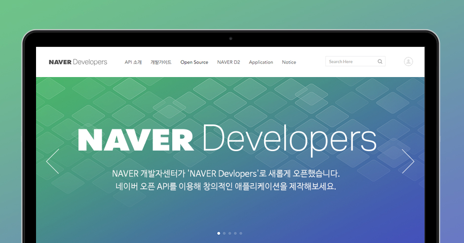

# 인공지능 API 소개
## [목 차]

[1. 개 요](#1-개-요)

[2. 대표적인 인공지능 API](#2-대표적인-인공지능-api)
  - [2.1 구글](#21-구글)

[3. 프로젝트 1에서 활용해 볼 API 선정 및 설명]()

* * *

## 1. 개 요
* * *
**인공지능 API**는 개발자들이 인공지능 기술을 활용할 수 있도록 제공되는 *프로그래밍 인터페이스*이다. 이를 통해 개발자는 강력한 자연어 처리, 이미지 분석, 음성인식 등과 같은 기능을 손쉽게 구현할 수 있다.

다양한 회사와 플랫폼에서 인공지능 API를 제공하고 있다. 가장 유명한 예로는 OpenAI의 GPT-3가 있다. 다른 회사들도 비슷한 형태로 자체적인 인공지능 API를 제공하고 있으며, 이를 활용하여 다양한 애플리케이션 및 서비스를 개발할 수 있다.

GPT-3에 대해 더 알아보기

GPT-3 API 호출 방법은 다음과 같다:

1. OpenAI 웹사이트에서 계정을 생성하고 로그인한다.
2. 계정 설정 페이지에서 "API Keys" 또는 "API Tokens"과 같은 항목을 찾아서 열어준다.
3. 새로운 API 키 또는 토큰을 생성한다.
4. 생성된 키 또는 토큰을 사용하여 HTTP 요청으로 GPT-3 API에 접근한다.

## 2. 대표적인 인공지능 API
* * *

### 2.1 구글

**구글 클라우드(Google Cloud)** 는 구글에서 제공하는 클라우드 컴퓨팅 플랫폼이다. 구글 클라우드 API는 개발자들이 구글 클라우드의 다양한 서비스와 기능을 활용할 수 있도록 제공되는 API이다. 이를 통해 개발자는 인공지능, 데이터 분석, 스토리지, 머신러닝 등 다양한 기능을 사용할 수 있다.
* [Google Cloud](https://cloud.google.com/vision?hl=ko)

## 3. 프로젝트1에서 활용해 볼 API 선정 및 설명
* * *
**naver developer**는 네이버에서 제공하는 오픈 API 가이드와 SDK를 통해 개발자들이 다양한 애플리케이션을 개발할 수 있도록 돕는 프로그램이다.

네이버 오픈 API를 활용하면 네이버 플랫폼의 기능을 외부 개발자가 쉽게 이용할 수 있게 된다.

네이버 개발자 프로그램은 개발자들이 공유성장, 경험 공유, 기술 지식 생산을 위해 함께하는 프로그램이다

* [Naver Developer](https://developers.naver.com/main/)

